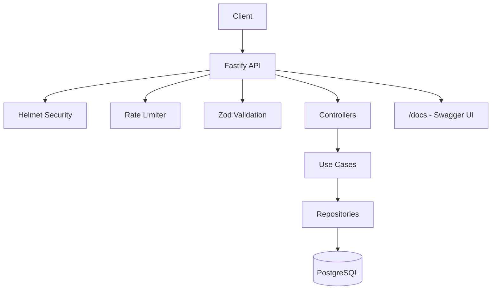

# Quranic Recitations API

[](https://github.com/syafiqhadzir/stg-api/actions/workflows/ci.yml)
[](https://sonarcloud.io/summary/new_code?id=syafiqhadzir_stg-api)
[](https://sonarcloud.io/summary/new_code?id=syafiqhadzir_stg-api)
[](https://opensource.org/licenses/MIT)
[](https://nodejs.org/)
[](https://www.typescriptlang.org/)
[](https://fastify.io/)

A high-performance, containerized REST API for comparing Quranic text variants across the ten canonical recitations (Qiraat). Built with **Fastify**, **PostgreSQL**, and **Clean Architecture**.

## 📋 Table of Contents

- [Features](#-features)
- [Architecture](#️-architecture)
- [Tech Stack](#️-tech-stack)
- [Quick Start](#-quick-start)
- [Configuration](#️-configuration)
- [API Reference](#-api-reference)
- [Testing](#-testing)
- [Development](#-development)
- [Security](#-security)
- [Troubleshooting](#-troubleshooting)
- [Documentation](#-documentation)
- [Contributing](#-contributing)
- [Acknowledgments](#-acknowledgments)
- [License](#-license)

## ✨ Features

- **Verse Comparison**: Query any verse and retrieve all recitation variants in a single response
- **OpenAPI Documentation**: Interactive Swagger UI at `/docs`
- **Type-Safe**: Full TypeScript with Zod validation
- **Production-Ready**: Distroless Docker image, rate limiting, and security headers
- **Database Migrations**: Version-controlled schema changes with node-pg-migrate
- **100% Test Coverage**: Comprehensive unit and integration testing

## �️ Architecture



## �🏗️ Tech Stack

| Layer | Technology |
|-------|------------|
| **Runtime** | Node.js 22 (LTS) |
| **Framework** | Fastify 5.x |
| **Language** | TypeScript 5.x |
| **Database** | PostgreSQL 16+ |
| **Validation** | Zod 4.x |
| **Documentation** | OpenAPI 3.0 / Swagger UI |
| **Migrations** | node-pg-migrate |
| **Testing** | Vitest |
| **Container** | Docker (Distroless) |

## 🚀 Quick Start

### Prerequisites

- [Docker](https://www.docker.com/) & Docker Compose
- [Node.js 22+](https://nodejs.org/) (for local development)

### Using Docker (Recommended)

```bash
# Start all services
docker-compose up --build -d

# Verify the API is running
curl "http://localhost:3000/api/v1/compare?surah=1&ayah=1"

# View API documentation
# Windows: start http://localhost:3000/docs
# macOS: open http://localhost:3000/docs
# Linux: xdg-open http://localhost:3000/docs
```

### Local Development

```bash
# Install dependencies
npm ci

# Copy environment configuration
cp .env.example .env

# Start database
docker-compose up db -d

# Build and start API
npm run build
npm start
```

## ⚙️ Configuration

Create a `.env` file from the example:

```bash
cp .env.example .env
```

| Variable | Required | Default | Description |
|----------|----------|---------|-------------|
| `NODE_ENV` | ❌ | `development` | Environment mode (`development`, `production`, `test`) |
| `PORT` | ❌ | `3000` | Server port |
| `DB_HOST` | ❌ | `localhost` | PostgreSQL host |
| `DB_PORT` | ❌ | `5432` | PostgreSQL port |
| `DB_USER` | ❌ | `postgres` | Database username |
| `DB_PASS` | ❌ | `postgres` | Database password |
| `DB_NAME` | ❌ | `quran_db` | Database name |

## 📚 API Reference

### Interactive Documentation

Visit **[http://localhost:3000/docs](http://localhost:3000/docs)** for the Swagger UI.

### Endpoints

| Method | Endpoint | Description |
|--------|----------|-------------|
| GET | `/compare` | Compare verse variants across Qiraat |
| GET | `/surahs` | List all 114 surahs |
| GET | `/surahs/:surah` | Get a surah with all verses |
| GET | `/qiraat` | List available Qiraat |
| GET | `/juz/:juz` | Get verses by Juz (1-30) |
| GET | `/page/:page` | Get verses by page |
| GET | `/search` | Search Quranic text |

> See [docs/API.md](docs/API.md) for complete API documentation.

### Quick Example

```bash
# Compare verse variants
curl "http://localhost:3000/api/v1/compare?surah=1&ayah=1"

# List all surahs
curl "http://localhost:3000/api/v1/surahs"

# Get Juz 1
curl "http://localhost:3000/api/v1/juz/1"
```

## 🧪 Testing

We use **Vitest** with 100% code coverage enforcement.

```bash
# Run all tests
npm test

# Run tests with coverage report
npm run test:coverage

# Run linting
npm run lint

# Check formatting
npx prettier --check "src/**/*.ts"
```

## 🔧 Development

### Project Structure

```
src/
├── app.ts                 # Fastify application setup
├── config.ts              # Environment configuration
├── routes.ts              # API route definitions
├── controllers/           # Request handlers
├── usecases/              # Business logic
├── repositories/          # Data access layer
└── types/                 # TypeScript types & Zod schemas

dist/src/                  # Compiled JavaScript output
└── ...                    # Mirrors src/ structure
```

### Available Scripts

| Script | Description |
|--------|-------------|
| `npm run build` | Compile TypeScript |
| `npm start` | Start production server |
| `npm test` | Run tests |
| `npm run test:coverage` | Run tests with coverage |
| `npm run test:e2e` | Run E2E tests |
| `npm run lint` | Run ESLint with auto-fix |
| `npm run format` | Format code with Prettier |
| `npm run migrate` | Run database migrations |
| `npm run migrate:create` | Create a new migration file |

## 🔒 Security

This API implements security best practices:

- **Helmet**: Sets secure HTTP headers (CSP, HSTS, X-Frame-Options, etc.)
- **Rate Limiting**: 100 requests per minute per client IP
- **Input Validation**: All inputs validated via Zod schemas
- **Response Serialization**: Responses validated against schemas to prevent data leaks

## ❓ Troubleshooting

<details>
<summary><strong>Database connection fails</strong></summary>

Ensure PostgreSQL is running and environment variables are correctly set:

```bash
# Check if database container is running
docker-compose ps

# Start database only
docker-compose up db -d

# Check logs
docker-compose logs db
```
</details>

<details>
<summary><strong>Port 3000 already in use</strong></summary>

Change the port via environment variable:

```bash
# Linux/macOS
PORT=3001 npm start

# Windows (PowerShell)
$env:PORT=3001; npm start
```
</details>

<details>
<summary><strong>Response serialization errors</strong></summary>

This usually means the database returned data in an unexpected format. Check that:
1. Database migrations have been run: `npm run migrate up`
2. Data has been ingested properly
3. Check the application logs for specific field mismatches
</details>

## 📖 Documentation

For detailed documentation, see the [docs/](docs/) directory:

| Guide | Description |
|-------|-------------|
| [Architecture](docs/ARCHITECTURE.md) | System design and data model |
| [API Reference](docs/API.md) | Complete endpoint documentation |
| [Database](docs/DATABASE.md) | Schema, migrations, and queries |
| [Testing](docs/TESTING.md) | Test strategy and coverage |
| [Security](docs/SECURITY.md) | Security measures and config |

## 🤝 Contributing

See [CONTRIBUTING.md](CONTRIBUTING.md) for guidelines on:
- Setting up your development environment
- Coding standards and conventions
- Pull request process

## 🙏 Acknowledgments

- Quranic text data sourced from authentic scholarly sources
- Built with [Fastify](https://fastify.io/) - Fast and low overhead web framework
- API documentation powered by [Swagger UI](https://swagger.io/tools/swagger-ui/)

## 📄 License

This project is licensed under the [MIT License](LICENSE).