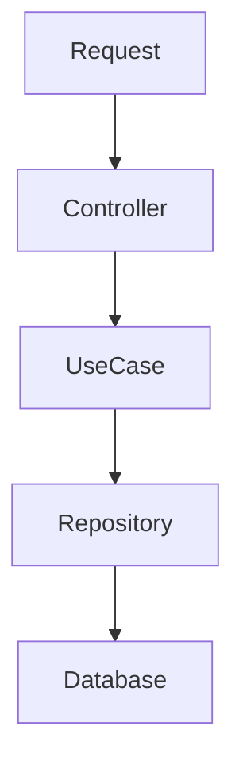

# System Architecture

## 1. Domain Overview

The core domain problem is **Textual Alignment** of 10+ canonical Quranic Recitations (Qira'at). 
- **Challenge**: Different Qira'at have different verse counts and numbering schemes (e.g., verse 10 in Hafs might be verse 9 in Warsh).
- **Solution**: We establish **Hafs 'an 'Asim** as the Canonical Skeleton. All other variants are mapped to the Hafs `(surah, ayah)` dimension.

## 2. Data Model

The database uses a normalized PostgreSQL schema optimized for read-heavy workloads through a Materialized View.

### Core Tables
- **`quran_verses` (Dimensions)**: 
  - Contains the canonical list of 6236 verses (Hafs count).
  - Columns: `id`, `surah_number`, `ayah_number`, `juz`, `page`.
  
- **`qiraat_metadata` (Dimensions)**:
  - Stores metadata about the reciters (e.g., Name: "Warsh", Slug: "warsh").

- **`recitation_texts` (Fact)**:
  - Stores the actual text for a specific `(verse_id, qiraat_id)` pair.
  - Supports `JSONB` metadata for extra attributes (line number, start/end).

### Performance Optimization
- **`mv_comparison_matrix`**:
  - A Materialized View that pivots the row-based `recitation_texts` into a JSON document per verse.
  - **Benefit**: `GET /compare` queries become a simple `SELECT * FROM mv... WHERE surah=X AND ayah=Y`, executing in O(1) time without complex runtime joins.

## 3. Ingestion Pipeline (`ingest.py`)

A Python-based ETL pipeline handles the complexity of data alignment.

1. **Pass 1 (Base Layer)**: Ingests `hafsData.csv`. Populates `quran_verses`, `qiraat_metadata` (Hafs), and `recitation_texts`.
2. **Pass 2 (Variant Layers)**: Iterates through other CSVs (Warsh, Douri, etc.).
   - Looks up the `verse_id` using `(surah, ayah)` key.
   - Using this alignment, inserts the variant text into `recitation_texts`.
3. **Pass 3 (Refresh)**: Triggers `REFRESH MATERIALIZED VIEW` to update the read layer.

## 4. Backend Architecture

The API uses **Fastify** implementation of **Clean Architecture**.

- **Controller**: Parses input (Zod validation), formats response. **No logic.**
- **UseCase**: Orchestrates business flow (e.g., "Get Comparison"). **Pure logic.**
- **Repository**: internal implementation of database access (SQL). **Data only.**
- **DI (Dependency Injection)**: Components are wired manually in `src/routes.ts` (or `app.ts`) to ensure testability.
