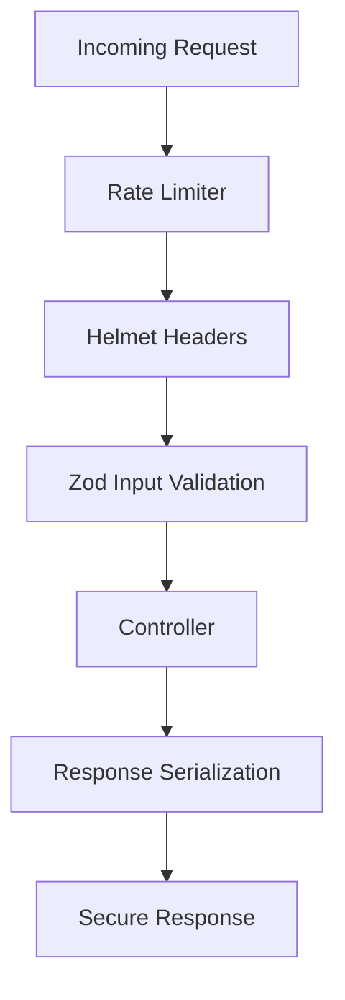

# Security Guide

Documentation of security measures implemented in the Quranic Recitations API.

## Security Layers



---

## HTTP Security Headers (Helmet)

The API uses [@fastify/helmet](https://github.com/fastify/fastify-helmet) to set secure HTTP headers.

### Enabled Protections

| Header | Purpose |
|--------|---------|
| `Content-Security-Policy` | Prevents XSS by restricting resource loading |
| `X-Content-Type-Options` | Prevents MIME type sniffing |
| `X-Frame-Options` | Prevents clickjacking |
| `Strict-Transport-Security` | Enforces HTTPS (in production) |
| `X-XSS-Protection` | Legacy XSS protection |
| `Referrer-Policy` | Controls referrer information |

### Configuration

```typescript
// src/app.ts
import helmet from '@fastify/helmet';

app.register(helmet);
```

---

## Rate Limiting

Protection against abuse and DoS attacks via [@fastify/rate-limit](https://github.com/fastify/fastify-rate-limit).

### Configuration

| Setting | Value |
|---------|-------|
| Max requests | 100 |
| Time window | 1 minute |
| Scope | Per client IP |

```typescript
// src/app.ts
import rateLimit from '@fastify/rate-limit';

app.register(rateLimit, {
  max: 100,
  timeWindow: '1 minute',
});
```

### Rate Limit Response

When limit is exceeded:

```http
HTTP/1.1 429 Too Many Requests
Retry-After: 60
X-RateLimit-Limit: 100
X-RateLimit-Remaining: 0
X-RateLimit-Reset: 1703328060
```

---

## Input Validation

All inputs are validated using [Zod](https://zod.dev/) schemas before processing.

### Query Parameter Validation

```typescript
// src/types/index.ts
export const ComparisonQuerySchema = z.object({
  surah: z.coerce.number().min(1).max(114),
  ayah: z.coerce.number().min(1),
});
```

### Validation Errors

Invalid input returns structured error:

```json
{
  "statusCode": 400,
  "error": "Bad Request",
  "message": "querystring/surah must be <= 114"
}
```

---

## Response Serialization

The API uses `fastify-type-provider-zod` to validate outgoing responses.

### Benefits

- **Data leak prevention**: Only schema-defined fields are returned
- **Type safety**: Ensures responses match OpenAPI spec
- **Early error detection**: Catches serialization issues before production

### Configuration

```typescript
// src/app.ts
import { serializerCompiler, validatorCompiler } from 'fastify-type-provider-zod';

app.setValidatorCompiler(validatorCompiler);
app.setSerializerCompiler(serializerCompiler);
```

---

## Environment Variables

Sensitive configuration is loaded from environment variables, validated at startup.

### Validation

```typescript
// src/config.ts
const envSchema = z.object({
  NODE_ENV: z.enum(['development', 'production', 'test']).default('development'),
  PORT: z.coerce.number().default(3000),
  DB_HOST: z.string().default('localhost'),
  DB_PORT: z.coerce.number().default(5432),
  DB_USER: z.string().default('postgres'),
  DB_PASS: z.string().default('postgres'),
  DB_NAME: z.string().default('quran_db'),
});
```

### Startup Behavior

Invalid environment variables cause immediate exit with clear error:

```
❌ Invalid environment variables:
└─ PORT: Expected number, received "invalid"
```

---

## CORS Configuration

Cross-Origin Resource Sharing is configured via [@fastify/cors](https://github.com/fastify/fastify-cors).

```typescript
// src/app.ts
import cors from '@fastify/cors';

app.register(cors);  // Allows all origins in development
```

> **Production Note**: Configure specific allowed origins for production deployment.

---

## Database Security

### Connection Pooling

PostgreSQL connections use `pg` with proper connection handling:

```typescript
// src/db.ts
const pool = new Pool({
  host: env.DB_HOST,
  port: env.DB_PORT,
  user: env.DB_USER,
  password: env.DB_PASS,
  database: env.DB_NAME,
});
```

### SQL Injection Prevention

All queries use parameterized statements:

```typescript
// ✅ Safe: Parameterized query
const result = await query(sql, [surah, ayah]);

// ❌ Unsafe: String interpolation (never used)
// const result = await query(`SELECT * WHERE id = ${id}`);
```

---

## Security Checklist

| Measure | Status |
|---------|--------|
| Helmet security headers | ✅ Enabled |
| Rate limiting | ✅ 100 req/min |
| Input validation (Zod) | ✅ All endpoints |
| Response serialization | ✅ Schema-validated |
| Environment validation | ✅ Startup check |
| Parameterized queries | ✅ All SQL |
| CORS | ✅ Configured |

---

## Reporting Vulnerabilities

If you discover a security vulnerability, please:

1. **Do not** open a public issue
2. Email security concerns to the maintainer
3. Allow time for a fix before public disclosure

---

← [Back to Documentation](README.md)
